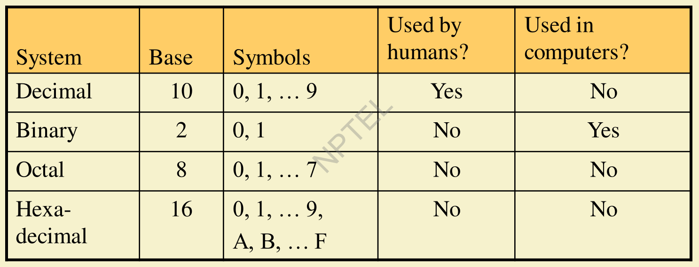
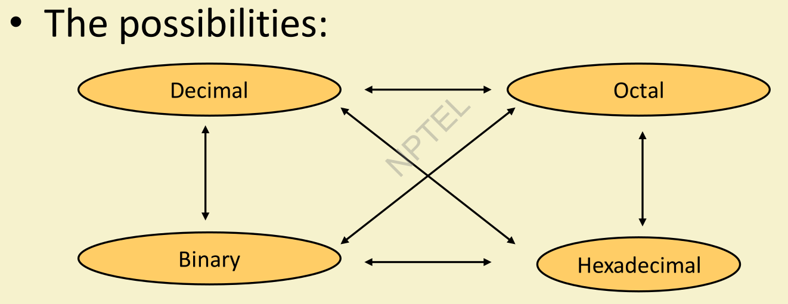
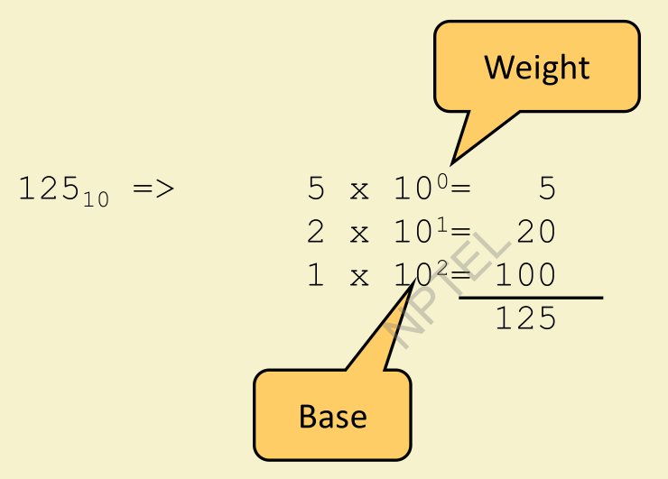
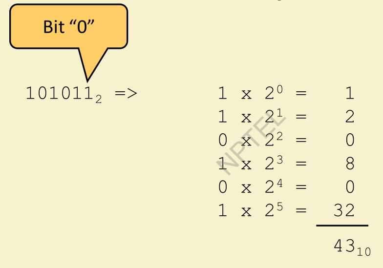
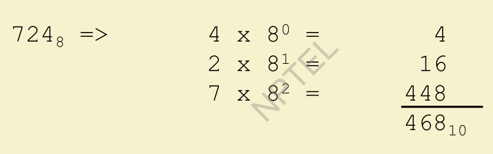
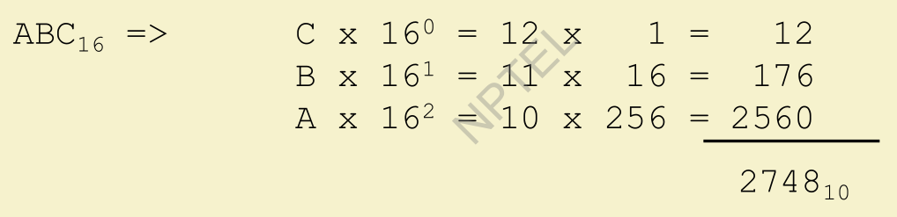
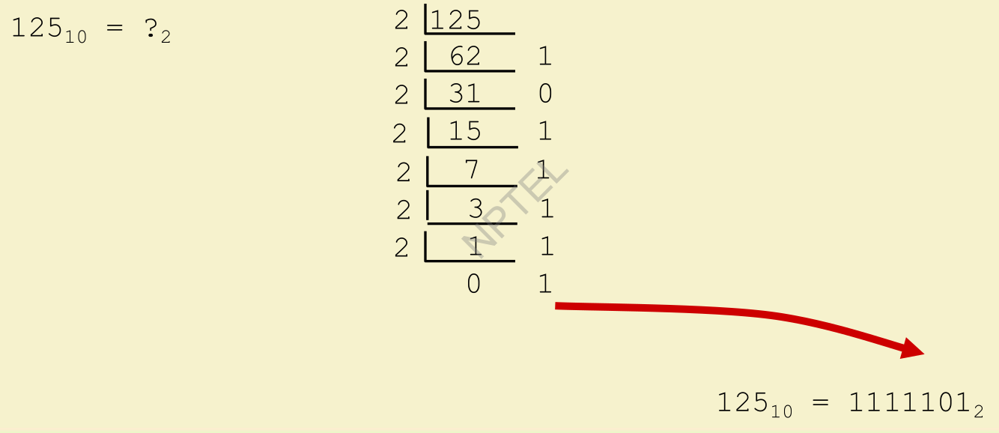
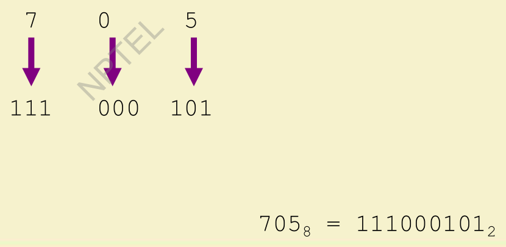
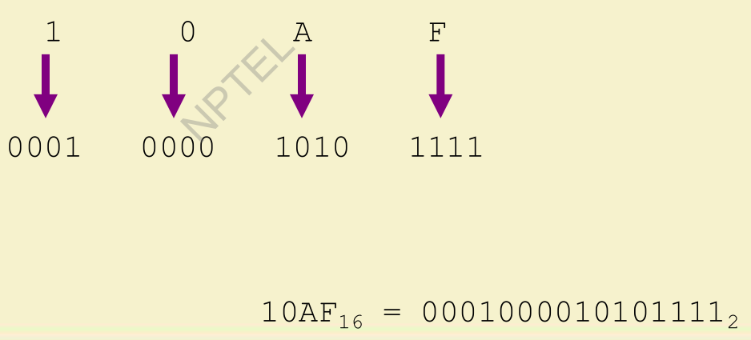

# Number Systems

## Common Number Systems



**Questions**
- What Number System are you using? **Decimal**\
=> Symbols : 0 to 9

- How many digits you need for a number? **3**\
=> Range: 0 (Min) to 999 (Max)

- Whenever we are refering to a certain bit processor like 16 bit, 32 bit, 64 bit processor\
=>It essential means a 16 bit architecture can work or store upto $2^{16}$ values.

**1 to 25 Numbers in different Number Systems**

| Decimal | Binary | Octal | Hexadecimal |
| :-: | :-: | :-: | :-: |
| 0 | 0 | 0 | 0 |
| 1 | 1 | 1 | 1 |
| 2 | 10 | 2 | 2 |
| 3 | 11 | 3 | 3 |
| 4 | 100 | 4 | 4 |
| 5 | 101 | 5 | 5 |
| 6 | 110 | 6 | 6 |
| 7 | 111 | 7 | 7 |
| 8 | 1000 | 10 | 8 |
| 9 | 1001 | 11 | 9 |
| **10** | 1010 | 12 | **A** |
| **11** | 1011 | 13 | **B** |
| **12** | 1100 | 14 | **C** |
| **13** | 1101 | 15 | **D** |
| **14** | 1110 | 16 | **E** |
| **15** | 1111 | 17 | **F** |
| 16 | 10000 | 20 | 10 |
| 17 | 10001 | 21 | 11 |
| 18 | 10010 | 22 | 12 |
| 19 | 10011 | 23 | 13 |
| 20 | 10100 | 24 | 14 |
| 21 | 10101 | 25 | 15 |
| 22 | 10110 | 26 | 16 |
| 23 | 10111 | 27 | 17 |
| 24 | 11000 | 30 | 18 |
| 25 | 11001 | 31 | 19 |


You might be confussed at the Binary, Octal and Hexadecimal Number Systems.
Don't worry! We will learn about these in detail.
**Quick Example:**
$$ 25_{10} = 11001_2 = 31_8 = 19_{16} $$

**We will do following conversions among different bases**



<div style="page-break-after: always;"></div>

# INTO DECIMAL SYSTEM   

## 1) Decimal to Decimal

## $$ 125 = 125_{10} = \underline{1} * (10^2)  +  \underline{2} * (10^1) + \underline{5} * (10^0) $$
## $$ = 100 + 20 + 5 =125_{10} $$



## 2) Binary to Decimal

## $$ 101011_2 = \underline{1} * (2^5) + \underline{0} * (2^4) + \underline{1} * (2^3) + \underline{0} * (2^2) + \underline{1} * (2^1) + \underline{1} * (2^0) $$
## $$  = \underline{1} * (32) + \underline{0} * (16) + \underline{1} * (8) + \underline{0} * (4) + \underline{1} * (2) + \underline{1} * (1)  $$
## $$  = 32 + 0 + 8 + 0 + 2 + 1 = 43 = 43_{10}  $$



## 3) Octal to Decimal

## $$ 724_8 = \underline{7} * (8^2) + \underline{2} * (8^1) + \underline{4} * (8^0) $$
## $$  = \underline{7} * (64) + \underline{2} * (8) + \underline{4} * (1) $$
## $$ = 448 + 16 + 4 = 468 = 468_{10} $$



## 4) Hexadecimal to Decimal

## $$ ABC_{16} = \underline{A} * (16^2) + \underline{B} * (16^1) + \underline{C} * (16^0) $$
## $$ = \underline{10} * (16^2) + \underline{11} * (16^1) + \underline{12} * (16^0) $$
## $$ =  \underline{10} * (256) + \underline{11} * (16) + \underline{12} * (1) $$
## $$ = 2560 + 176 + 12 = 2748 = 2748_{10} $$ 



<div style="page-break-after: always;"></div>

# INTO BINARY

## 1) Decimal to Binary  $$ 125_{10} = ( )_2 $$

### Divide by two (2), keep track of the remainder.

```
2)125(62 
  124
  ---
   1   ==> This is the right most bit.  = _ _ _ _ _ _ 1 


2)62(31
  62
  --
   0   ==> This is the next right most bit.  = _ _ _ _ _ 0 1


2)31(15
  30
  --
   1   ==> This is the next right most bit.  = _ _ _ _ 1 0 1


2)15(7
  14
  --
   1   ==> This is the next right most bit.  = _ _ _ 1 1 0 1


2)7(3
  6
  --
  1   ==> This is the next right most bit.  = _ _ 1 1 1 0 1


2)3(1
  2
  --
  1   ==> This is the next right most bit.  = _ 1 1 1 1 0 1


2)1(   

If "Dividend" is 0 or 1, then it is last step.

==> Dividend is the left most bit.  = 1 1 1 1 1 0 1
```

## Result: $ 125_{10} = ( 1 1 1 1 1 0 1 )_2 $



## 2) Octal to Binary (Using 2 Methods)

## A) Convert Octal to Decimal, then Decimal to Binary.

### $ 705_8 = ?_2 $
### $ 705_8 = \underline{7} * (8^2) + \underline{0} * (8^1) + \underline{5} * (8^0) = 452_{10} $
### $ 452_{10} = 111000101_2 $
### $ \therefore 705_8 = 111000101_2 $

## B) Convert each octal digit to a 3-bit equivalent binary representation. ( Fastest Way)

### $ 705_8 = ?_2 $
###  Binary equivalent of :  $ 7_8 = 111_2 , 0_8 = 000_2 , 5_8 = 101_2 . $
### $ 705_8 =  (111)  (000) (101) _2 = 111  000 101 _2 $



## 3) Hexadecimal to Binary (Using 2 Methods)

## A) Convert Hexadecimal to Decimal, then Decimal to Binary.

### $ 10AF_{16} = ?_2 $
### $ 10AF_{16} = \underline{1} * (16^3) + \underline{0} * (16^2) + \underline{A} * (16^1) + \underline{15} * (16^0) = 4271_{10} $
### $ 4271_{10} = 0001 0000 1010 1111_2 $
### $ \therefore 10AF_{16} = 0001 0000 1010 1111_2 $

## B) Convert each hexadecimal digit to a 4-bit equivalent binary representation. ( Fastest Way)

### $ 10AF_{16} = ?_2 $
###  Binary equivalent of :  $ 1_{16} = 0001_2 , 0_{16} = 0000_2 , A_{16} = 1010_2, F_{16} = 1111_2 . $
### $ 10AF_{16} = (0001) (0000) (1010) (1111)_2 = 0001 0000 1010 1111_2 $



<div style="page-break-after: always;"></div>

## INTO OCTAL

## 1) Decimal to Octal $$ 1234_{10} = ?_8 $$

### Divide by eight (8), keep track of the remainder.

```
8)1234(154 
  1232
  ---
   2   ==> This is the right most bit.  = _ _ _ 2 


8)154(19
  152
  --
   2   ==> This is the next right most bit.  = _ _ 2 2


8)19(2
  16
  --
   3   ==> This is the next right most bit.  = _ 3 2 2


8)2(

If "Dividend" is less than 8, then it is last step.

==> Dividend is the left most bit. = 2 3 2 2
```

## Result: $ 1234_{10} = ( 2 3 2 2 )_8 $

## 2) Binary to Octal (Using 2 Methods) $$ 10101_2 = ?_8 $$

## A) Convert Binary to Decimal, then Decimal to Octal.

### $ 10101_2 = 21_{10} => 21_{10} = 25_8 $

## B) Group bits in threes, starting on right, then convert to octal digits. ( Fastest Way)

### $ 10101_2 = 010101_2 = (010) (101)_2  = 25_8 $
###  Binary equivalent of :  $ 010_2 = 2_8 , 101_2 = 5_8 . $
### $ \therefore 10101_2 =  25_8 $


## 3) Hexadecimal to Octal (Using 2 Methods)

## A) Convert Hexadecimal to Decimal, then Decimal to Octal.

### $ 3B4_{16} = ?_8 $
### $ 3B4_{16} = \underline{3} * (16^2) + \underline{B} * (16^1) + \underline{4} * (16^0) = 948_{10} $
### $ 948_{10} = 1664_8 $
### $ \therefore 3B4_{16} = 1664_8 $

## B) Convert each hexadecimal digit to a 4-bit equivalent Binary representation.
## Then group bits in threes, starting from rifht, then convert to octal digits. ( Fastest Way)

### $ 3B4_{16} = ?_8 $
###  Binary equivalent of :  $ 3_{16} = 0011_2 , B_{16} = 1011_2 , 4_{16} = 0100_2 . $
### $ 3B4_{16} = (0011) (1011) (0100)_2 = (001) (110) (110) (100)_2 = 1664_8$

<div style="page-break-after: always;"></div>

## INTO HEXADECIMAL

## 1) Decimal to Hexadecimal $$ 1234_{10} = ?_8 $$

### Divide by sixteen (16), keep track of the remainder.

```
16)125(62 
  124
  ---
   1   ==> This is the right most bit.  = _ _ _ _ _ _ 1 


16)62(31


```
