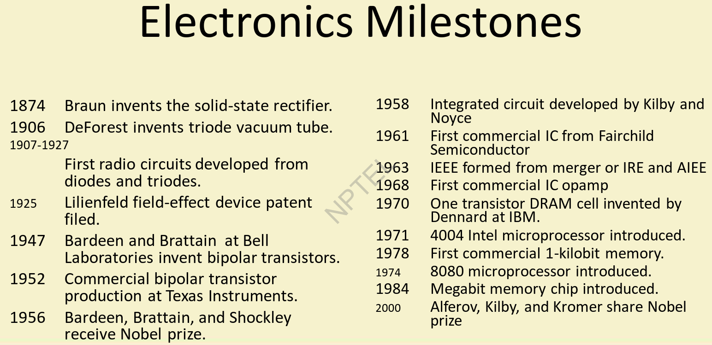

<h1 align="center" style="color: #0073CF;">Digital Circuits by Prof. Satanu Chattopadhyay, IIT Khrg</h1>

- This Course lay the foundations for people who are interested in:

    - **VLSI Design**
    - **Embedded Systems OR IoT Devices**
    - **Courses like : Compiler Design, Computer System Design, COA, OS**
    - **Knowing the Basics of Computers or Microprocessors**

- This course is helpful for **GATE Preparation** in CSE.

## The Start of the Modern Electronics Era

- Brattain and Bardeen invented the bipolar transistor in 1947 at Bell Labs.

## Evolution of Electronic Devices

- Vaccum Tubes
- Discrete Transistors
- SSI (Small Scale Integrated) and MSI (Medium Scale Integrated) Integrated Circuits
    - SSI Chips will have about 100 transistors
    - MSI Chips will have about 1000 transistors
    - LSI Chips will have about 10000 transistors
    - VLSI Chips will have about 1 million transistors
    - ULSI (Ultra) Chips will have > 1 million transistors
    - GSI (Giga) Chips will have > 1 billion transistors
- VLSI Surface-Mount Circuits

## 5 Commendments

- **Moore’s Law :** The number of transistors on a chip doubles annually
- **Rock’s Law :** The cost of semiconductor tools doubles every four years
    - Because of increasing complexity of the chips
    
- **Machrone’s Law:** The PC you want to buy will always be $5000
- **Metcalfe’s Law :** A network’s value grows proportionately to the number of its users squared
- **Wirth’s Law :** Software is slowing faster than hardware is accelerating

Further Reading: “5 Commandments”, IEEE Spectrum December 2003, pp. 31-35.

## Analog versus Digital Electronics

- Most observables are analog in nature
    - Example:- Temperature, Sound, Light, Intensity, etc ...
- But the most convenient way to represent and transmit information electronically is digital
- Analog/digital and digital/analog conversion is essential

## Digital signal representation & Representation of logical functions

- By using binary numbers we can represent any quantity in digital form
- Performing logic with binary variables is called switching algebra or Boolean algebra

    - **Boolean Algebra** was introduced in 1847 & 1854 by George Boole in his books as pure mathematics.
    - Later, **Claude Elwood Shannon**, father of information technology, applied in digital circuits
- Digital signals can be transmitted, received, amplified, and retransmitted with no degradation.

## Signal Types - Analog and Digital Signals

- Analog signals take on continuous values in time - typically current or
voltage
    - After digitization, the continuous analog signal becomes a set of discrete values, typically separated by fixed time intervals
    - The problem with analog signals is noise
- Digital signals appear at discrete levels - usually we use binary
signals which utilize only two levels
    - One level is referred to as logical 1 and logical 0 is assigned to the
other level.

### Digital-to-Analog Conversion (DAC)

- For an n-bit D/A converter, the output voltage is expressed as:

$$ V_0 = (b_1 * 2^{-1} + b_2 * 2^{-2} +  ... + b_n * 2^{-n} )V_{FS} $$

- The smallest possible voltage change is known as the least significant bit or LSB:

$$ V_{LSB} = 2^{-n} * V_{FS} $$

### Analog-to-Digital Conversion (ADC)

- Analog input voltage **v**$_x$ is converted to the nearest n-bit number.
- For a four bit converter, 0 --> **v**$_x$ input yields a 0000 --> 1111 digital output.
- Output is approximation of input due to the limited resolution of the n-bit
output. Error is expressed as:

$$ V_{\epsilon} = | v_x - (b_1 * 2^{-1} + b_2 * 2^{-2} +  ... + b_n * 2^{-n} )V_{FS} | $$

